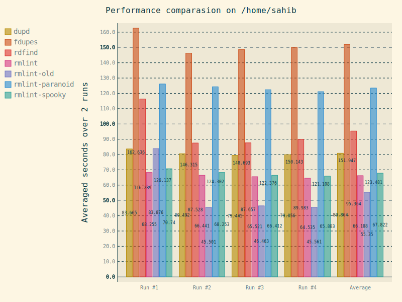

Benchmarks
==========

We will post some benchmark results here once the respective scripts
are ready enough. Here, have some early one to see what they look like:

User benchmarks
---------------

If you like, you can add your own benchmarks below. 
Maybe include the following information:

- ``rmlint --version``
- ``uname -a`` or similar.
- Hardware setup, in particular the filesystem.
- The summary printed by ``rmlint`` in the end.
- Did it match your expectations?

If you have longer output you might want to use a pastebin like gist_.

.. _gist: https://gist.github.com/

.. raw:: html

   

   
   <noscript>Please enable JavaScript to view the <a href="https://disqus.com/?ref_noscript" rel="nofollow">comments powered by Disqus.</a></noscript>

   
