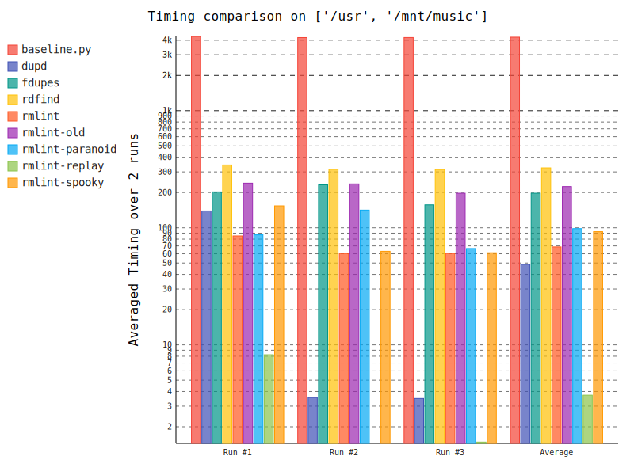
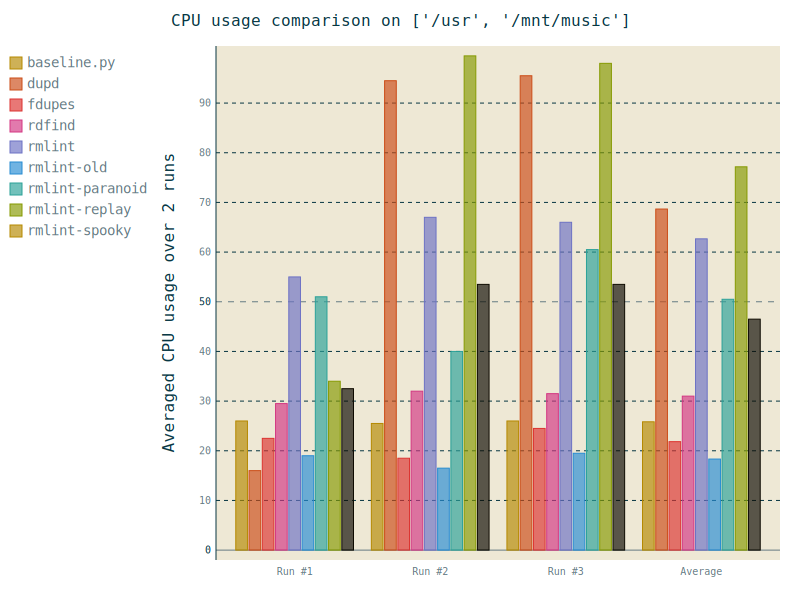
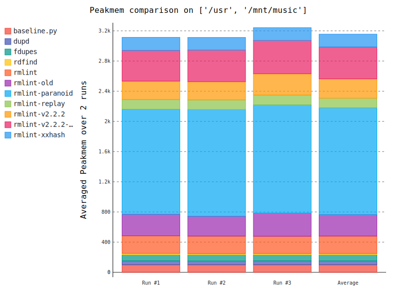

.. _benchmark_ref:

Benchmarks
==========

This page contains the images that our _`benchmark suite` renders for the current
release. Inside the benchmark suite, ``rmlint`` is *challenged* against other
popular and some less known duplicate finders. Apart from that a very dumb
duplicate finder called ``baseline.py`` is used to see how slow a program would
be that would blindly hash all files it finds. Luckily none of the programs is
*that* slow. We'll allow us a few remarks on the plots, although we focus a bit
on ``rmlint``. You're of course free to interpret something different or re-run_
the benchmarks on your own machine. The exact version of each program is given
in the plots.

It should be noted that it is very hard to compare these tools, since *each*
tool investigated a slightly different amount of data and produces different
results on the dataset below. This is partly due to the fact that some tools
count empty files and hardlinks as duplicates, while ``rmlint`` does not. Partly
it might also be false positives, missed files or, in some tools, `paths that
contain a ','`_. For ``rmlint`` we verified that no false positives are in the
set.

.. _`benchmark suite`: https://github.com/sahib/rmlint/tree/develop/tests/test_speed
.. _re-run: https://github.com/sahib/rmlint/issues/131
.. _`paths that contain a ','`: https://github.com/jvirkki/dupd/blob/master/src/scan.c#L83

Here are some statistics on the datasets ``/usr`` and ``/mnt/music``. ``/usr``
is on a ``btrfs`` filesystem that is located on an SSD with many small files,
while ``/mnt/music`` is located on a rotational disk with ``ext4`` as
filesystem. The amount of available memory was *8GB*.

.. code-block:: bash

    $ du -hs /usr
    7,8G	/usr
    $ du -hs /mnt/music
    213G    /mnt/music
    $ find /usr -type f ! -empty | wc -l
    284075
    $ find /mnt/music -type f ! -empty | wc -l
    37370
    $ uname -a
    Linux werkstatt 3.14.51-1-lts #1 SMP Mon Aug 17 19:21:08 CEST 2015 x86_64 GNU/Linux

*Note:* This plot uses logarithmic scaling for the time.

It should be noted that the first run is the most important run. At least for a
rather large amount of data (here 211 GB), it is unlikely that the file system
has all relevant files in its cache. You can see this with the second run of
``baseline.py`` - when reading all files the cache won't be useful at such large
file quantities. The other tools read only a partial set of files and can thus
benefit from caching on the second run. However ``rmlint`` (and also ``dupd``)
support fast re-running (see ``rmlint-replay``) which makes repeated runs very
fast. It is interesting to see ``rmlint-paranoid`` (no hash, incremental
byte-by-byte comparison) to be mostly equally fast as the vanilla ``rmlint``. 

``rmlint`` has the highest CPU footprint here, mostly due to its multithreaded
nature. Higher CPU usage is not a bad thing since it might indicate that the program
spends more time hashing files instead of switching between hashing and reading.
``dupd`` seems to be pretty efficient here, especially on re-runs.
``rmlint-replay`` has a high CPU usage here, but keep in mind that it does
(almost) no IO and only has to repeat previous outputs.

The most memory efficient program here seems to be ``rdfind`` which uses even
less than the bare bone ``baseline.py`` (which does not much more than holding a
hashtable). The well known ``fdupes`` is also low on memory footprint.

Before saying that the paranoid mode of ``rmlint`` is a memory hog, it should be
noted (since this can't be seen on those plots) that the memory consumption
scales very well. Partly because ``rmlint`` saves all paths in a Trie_, making
it usable for :math:`\geq` `5M files`_. Also it is able to control the amount of
memory it uses (``--limit-mem``). Due to the high amount of internal data
structures it however has a rather large base memory footprint.

``dupd`` uses direct file comparison for groups of two and three files and hash
functions for the rest. It seems to have a rather high memory footprint in any
case.

.. _Trie: https://en.wikipedia.org/wiki/Radix_tree
.. _`5M files`: https://github.com/sahib/rmlint/issues/109

.. raw:: html
   :file: _static/benchmarks/found_items.html

|

Surprisingly each tool found a different set of files. As stated above, direct
comparison may not be possible here. For most tools except ``rdfind`` and
``baseline.py`` it's about in the same magnitude of files. ``fdupes`` seems to
find about the same amount as ``rmlint`` (with small differences).
The reasons for this are not clear yet, but we're looking at it currently_.

.. _currently: https://github.com/sahib/rmlint/issues/131#issuecomment-143387431

User benchmarks
---------------

If you like, you can add your own benchmarks below.
Maybe include the following information:

- ``rmlint --version``
- ``uname -a`` or similar.
- Hardware setup, in particular the filesystem.
- The summary printed by ``rmlint`` in the end.
- Did it match your expectations?

If you have longer output you might want to use a pastebin like gist_.

.. _gist: https://gist.github.com/

.. raw:: html

   

   
   <noscript>Please enable JavaScript to view the <a href="https://disqus.com/?ref_noscript" rel="nofollow">comments powered by Disqus.</a></noscript>

   
