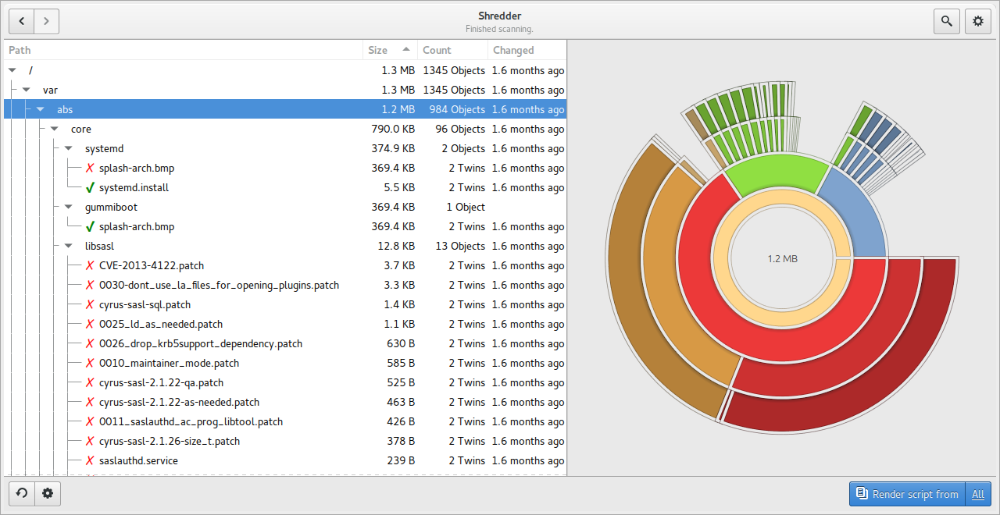
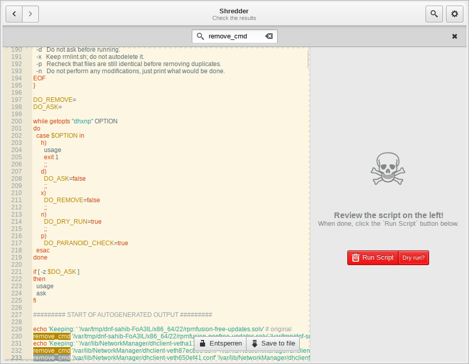
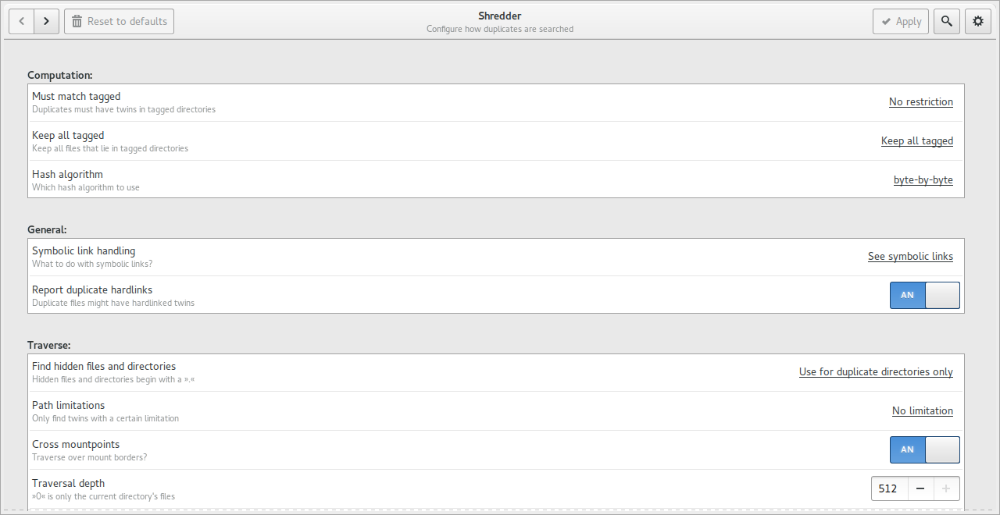

Graphical user interface
========================

As of ``rmlint`` :math:`\geq 2.4.0` a GUI frontend called ``Shredder`` is
shipped alongside of ``rmlint``. It is written in Python and uses no external 
dependencies beside ``gtk+`` :math:`\geq` and ``PyGObject``.

.. danger:: 

    The user interface is still in developement. Use at your own risk!

    There is a safety net though: Every file will be re-checked before it's
    deletion.  

Installation
------------

If you compiled ``rmlint`` from source, ``scons`` will try to build and install
the GUI, except you pass ``--without-gui`` to it.

Usage
-----

The gui can be started via ``rmlint --gui``.The application is divided into several
views that.

Developers
----------

Location view
~~~~~~~~~~~~~

.. image:: _static/gui_locations.png
   :width: 50%
   :align: center

Shows a list of locations the user might want to scan.  A number of locations is
guessed from the list of mounted volumes, recently used files and a static set
of paths.  The user can of course add a new location via a filebrowser.

The user can select one or multiple paths and hit *Scan*. In prior he might
choose to prefer certain paths, so only files in non-preferred paths are
deleted if they have a twin in a preferred path.

Runner view
~~~~~~~~~~~

After hitting scan in the locations view, the application will start ``rmlint``
in the background. The output will be shown live in the treeview on the left.

Once finished, a chart will be shown on the right that shows how the duplicates
are distributed over the scanned directories. The treeview will show the
detailed list of found files. A red cross will indicate that ``Shredder`` wants
to delete this file, a green checkmark will make it keep it.
The user can edit those to his liking. 

Additionally, the view can be filtered after a search query.

Once happy with the results, the user can generate a script out of the results
(all or just those that are visible).

Editor view
~~~~~~~~~~~

A source editor will show the generated script. It can be edited and searched
through. Apart from that, the file can be saved not only a ``.sh`` file, but
also as ``.csv`` and ``.json`` file. 

The user can now choose to save the script and execute it himself, or 
to click the ``Run Script`` button. If this button is blue, it indicates a dry
run, where nothing will be deleted. A red button however will kill your files.
In any way, a running counter of deleted bytes will be shown.

Settings view
~~~~~~~~~~~~~

The settings view is the leftmost view and will not be shown by default in the
process. It can always be accessed by:

- Going to the leftmost view.
- Hitting the ``Settings`` menu entry.
- Hit the gear button in the runner view.

Normal user probably do not need to adjust anything.
The options shown here, resemble the option that may be given to 
the commandline of ``rmlint``. 

Design
~~~~~~

The design loosely follows the Gnome Human Interface Guidelines. [*]_
Beside the appeareance, this means that the program should be easy and intuitive
to use. Suggested actions should be clear to recognize and the application
should always be responsive and never just *do work in the background*.

.. [*] https://developer.gnome.org/hig/stable/

Internal
~~~~~~~~

``Shredder`` works by forking off ``rmlint`` and reading it's json output in
parallel. The script generation works by calling ``rmlint --replay`` on the
generated ``json`` file, since this is the only sane way to filter the results
of all formats properly.
