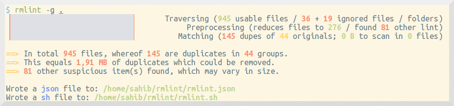

.. title is not shown in flask theme:

rmlint manual
=============

Introduction
------------

**rmlint** finds space waste and other broken things on your filesystem and offers
to remove it. It is able to find:

.. hlist::
   :columns: 2

   + Duplicate files.
   + Nonstripped Binaries 
   + Broken symlinks.
   + Empty files.
   + Recursive empty directories.
   + Files with broken user or group id.

**Key Features:**

.. hlist::
   :columns: 2

   + Extremely fast.
   + Exchangeable hashing algorithm.
   + Numerous output formats.
   + Easy commandline interface.
   + Possibility to update files with newer mtime.
   + Many options for originaldetection.

.. NOTE::

    **rmlint** is currently in the progress of being rewritten. 
    This means that it still may contain bugs that might burn your data.

    Use at your own risk!

Manual
------

.. toctree::
   :maxdepth: 2

   tutorial
   faq

Reference
---------

.. toctree::
   :maxdepth: 1
       
   install
   Manpage of rmlint <rmlint.1.in>
   rmlint_vs_the_world
   developers

Authors
-------

**rmlint** was and is written by: 

- Christopher <sahib_> P. -- Original author 
- Daniel <SeeSpotRun_> T. -- Emergency helper and duplicate author

Additional thanks to:

- TODO: list bug reporters and others. (kill old AUTHORS file)

License
-------

**rmlint** is licensed under the terms of GPLv3_.

.. _GPLv3: http://www.gnu.org/copyleft/gpl.htm
.. _sahib: https://github.com/sahib
.. _SeeSpotRun: https://github.com/SeeSpotRun

Donations
---------

If you think rmlint saved you some serious time and/or space, you might
consider a donation. 

* Either via *Flattr*:

.. raw:: html

   
   

* Or alternatively via *PayPal*:

.. raw:: html

   <form action="https://www.paypal.com/cgi-bin/webscr" method="post">
       <input type="hidden" name="cmd" value="_s-xclick">
       <input type="hidden" name="hosted_button_id" value="JXCXKRMS8EDVC">
       <input type="image" src="https://www.paypalobjects.com/en_US/i/btn/btn_donate_SM.gif" border="0" name="submit" alt="PayPal - The safer, easier way to pay online!">
       
   </form>

* Or just buy us a beer if we ever meet. Nice emails are okay too.
