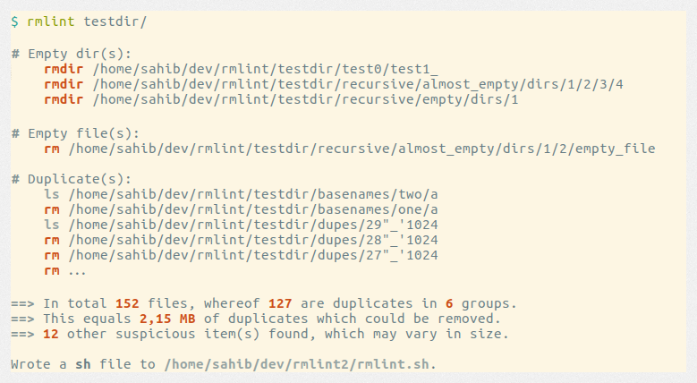

==========================
Gentle Guide to ``rmlint``
==========================

Welcome to the Tutorial of ``rmlint``.

.. image:: _static/shredder.svg
   :width: 45%
   :align: center

We use a few terms that might not be obvious to you at first,
so we gonna explain them to you here.

:*Original*:

    In a group of *duplicate* files, one file is said to
    be the original file. It might not, strictly speaking,
    be the original from which the copies where created,
    but is a convenient terminology for selecting which
    files to keep and which to delete.

:*Duplicate*:

    A file that matches the original.  Note that depending
    on rmlint settings, "match" may mean an exact match or
    just that the files have matching hash values (see XXX)

Beginner Examples
-----------------

Let's just dive in into some examples:

.. code-block:: bash

   $ rmlint

This simply scans your current working directory for lint and reports them in
your terminal. Note that **nothing will be removed** (even if it prints ``rm``).

Despite its name, ``rmlint`` just finds suspicious files, but never modifies the
filesystem itself [*]_.  Instead it gives you detailed reports in different
formats to get rid of them yourself. These reports are called *outputs*.  By
default a shellscript will be written to ``rmlint.sh`` that contains readily
prepared shell commands to remove duplicates and other finds,

.. [*] You could say it should be named ``findlint``.

So for the above example the full process, if you want to actually delete the
lint that was found, would be:

.. code-block:: bash

   $ rmlint some/path
   # (wait for rmlint to finish running)
   $ gedit rmlint.sh
   # (or any editor you prefer... review the content of rmlint.sh to
   #  check what it plans to delete; make any edits as necessary)
   $ ./rmlint.sh
   # (the rmlint.sh script will ask for confirmation, then delete the
   #  appropriate lint, then delete itself)

On larger runs, it might be more preferable to show a progressbar instead of a
long list of files. You can do this easily with the ``-g`` switch:

.. code-block:: bash

    $ rmlint -g

It will look like this:

Filtering input files
---------------------

What if we do not want to check all files as dupes? ``rmlint`` has a
good repertoire of options to select only certain files. We won't cover
all options, but will get you started with a few useful ones. Note if
you want a more do-it-yourself approach to file filtering, you
can also use external tools to feed ``rmlint's stdin``:

.. code-block:: bash

   $ find pics/ -iname '*.png' | rmlint -
   $ find pics/ -iname '*.png' -print0 | rmlint -0 # (also handles filenames with newline characters)

Limit files by size using ``--size``
~~~~~~~~~~~~~~~~~~~~~~~~~~~~~~~~~~~~

.. code-block:: bash

   # only check files between 20 MB and 1 Gigabyte:
   $ rmlint --size 20M-1G
   # short form (-s) works just as well:
   $ rmlint -s 20M-1G
   # only check files bigger than 4 kB:
   $ rmlint -s 4K
   # only check files smaller than 1234 bytes:
   $ rmlint -s 0-1234
   # Find empty files and handle them as duplicates:
   $ rmlint -T df --size 0-1

Valid units include:

|  K,M,G,T,P for powers of 1000
|  KB, MB, GB etc for powers of 1024

If no units are given, ``rmlint`` will assume bytes.

Limit duplicate matching according to basename
~~~~~~~~~~~~~~~~~~~~~~~~~~~~~

By default, ``rmlint`` compares file contents, regardless of file name.
So if *afile.jpg* has the same content as *bfile.txt* (which is unlikely!),
then ``rmlint`` will find and report this as a duplicate.
You can speed things up a little bit by telling rmlint not to try to
match files unless they have the same or similar file names.  The three
options here are:

|  ``-b`` (``--match-basename``)
|  ``-e`` (``--match-extension``)
|  ``-i`` (``--match-without-extension``) .

Examples:

.. code-block:: bash

   # Find all duplicate files with the same basename:
   $ rmlint -b some_dir/
   ls some_dir/one/hello.c
   rm some_dir/two/hello.c
   # Find all duplicate files that have the same extension:
   $ rmlint -e some_dir/
   ls some_dir/hello.c
   rm some_dir/hello_copy.c
   # Find all duplicate files that have the same basename:
   # minus the extension
   $ rmlint -e some_dir/
   ls some_dir/hello.c
   rm some_dir/hello.bak

Limit files by their modification time
~~~~~~~~~~~~~~~~~~~~~~~~~~~~~~~~~~~~~~

This is a useful feature if you want to investigate only files newer than
a certain date or if you want to progressively update the results, i.e. when you
run ``rmlint`` in a script that watches a directory for duplicates.

The manual way is using ``-N`` (``--newer-than=<timestamp>``):

.. code-block:: bash

   # Use a Unix-UTC Timestamp (seconds since epoch)
   $ rmlint -N 1414755960

   # Find all files newer than file.png
   $ rmlint -N $(stat --print %Y file.png)

   # Alternatively use an ISO8601 formatted Timestamp
   $ rmlint -N 2014-09-08T00:12:32+0200

If you are periodically checking the same directory tree for duplicates,
you can get a substantial speedup by creating an automatic timestamp file
each time you run rmlint.  To do this, use command line options:
``-n`` (``--newer-than-stamp``) and
``-O stamp:stamp.file`` (we'll come to outputs in a minute):
Here's an example for incrementally scanning your home folder:

.. code-block:: bash

   # First run of rmlint:
   $ rmlint /home/foobar -O stamp:/home/foobar/.rmlint.stamp
   ls /home/foobar/a.file
   rm /home/foobar/b.file

   # Second run, no changes:
   $ rmlint /home/foobar -n /home/foobar/.rmlint.stamp
   <nothing>

   # Second run, new file copied:
   $ cp /home/foobar/a.file /home/foobar/c.file
   $ rmlint /home/foobar -n /home/foobar/.rmlint.stamp
   ls /home/foobar/a.file
   rm /home/foobar/b.file
   rm /home/foobar/c.file

Note that ``-n`` updates the timestamp file each time it is run.

Outputs & Formatters
--------------------

``rmlint`` is capable of creating reports in several output formats, to
either your screen or to a file. If you run it with the default options you
already see two of those output formatters on your screen, namely ``pretty``
and ``summary``.

Extra output formats can be added via either the ``-O`` (``--add-output``)
or ``-o`` (``--output``) switch.  The only difference is the ``-o`` clears
all the default outputs while ``-O`` just adds to the defaults.

.. note::

    If you just came here to learn how to print a nice progressbar:
    Just use the ``-g`` (``--progress``) option:

    .. code-block:: bash

       $ rmlint -g /usr

Here's an example:

.. code-block:: bash

   $ rmlint -o json:stderr

Here you would get this output printed on ``stderr``:

.. code-block:: javascript

    [{
      "description": "rmlint json-dump of lint files",
      "cwd": "/home/user/",
      "args": "rmlint -o json:stderr"
    },
    {
      "type": "duplicate_file",
      "path": "/home/user/test/b/one",
      "size": 2,
      "inode": 2492950,
      "disk_id": 64771,
      "progress": 100,
      "is_original": true,
      "mtime": 1414587002
    },
    ... snip ...
    {
      "aborted": false,
      "total_files": 145,
      "ignored_files": 9,
      "ignored_folders": 4,
      "duplicates": 11,
      "duplicate_sets": 2,
      "total_lint_size": 38
    }]

You probably noticed the colon in the commandline above. Everything before it is
the name of the output-format, everything behind is the path where the output
should land. Instead of a path you can also use ``stdout`` and ``stderr``, as
we did above or just omit the colon which will print everything to ``stdout``.

Some formatters can be customised using the ``-c`` (``--config``) command.
Here's the list of currently available formatters and their config options:

:json:

    Outputs all finds as a json document. The document is a list of dictionaries,
    where the first and last element is the header and the footer respectively,
    everything between are data-dictionaries. This format was chosen to allow
    application to parse the output in realtime while ``rmlint`` is still running.

    The header contains information about the program invocation, while the footer
    contains statistics about the program-run. Every data element has a type which
    identifies its lint type (you can lookup all types here_).

    **Config values:**

    - *use_header=[true|false]:* Print the header with metadata.
    - *use_footer=[true|false]:* Print the footer with statistics.
    - *oneline=[true|false]:* Print one json document per line.

:sh:

    Outputs a shell script defines a command function for each lint type, which
    it then calls for each file of each type.  The script can be executed (it is
    already ``chmod +x``'d by ``rmlint``).
    By default it will ask you if you really want to proceed. If you
    do not want that confirmation prompt you can pass the ``-d``. Additionally
    it will delete itself after running, unless you pass the ``-x`` switch to
    the ``sh`` script.

    It is enabled by default and writes to ``rmlint.sh``.

    Example output:

    .. code-block:: bash

      $ rmlint -o sh:stdout
      #!/bin/sh
      # This file was autowritten by rmlint
      # rmlint was executed from: /home/user/
      # You command line was: ./rmlint -o sh:rmlint.sh

      # ... snip ...

      echo  '/home/user/test/b/one' # original
      remove_cmd '/home/user/test/b/file' # duplicate
      remove_cmd '/home/user/test/a/two' # duplicate
      remove_cmd '/home/user/test/a/file' # duplicate

      if [ -z $DO_REMOVE ]
      then
        rm -f 'rmlint.sh';
      fi

    **Config values:**

    - *clone*: ``btrfs`` only. Try to clone both files with the
      BTRFS_IOC_FILE_EXTENT_SAME ``ioctl(3p)``. This will physically delete
      duplicate extents. Needs at least kernel 4.2.
    - *reflink*: Try to reflink the duplicate file to the original. See also
      ``--reflink`` in ``man 1 cp``. Fails if the filesystem does not support
      it.
    - *hardlink*: Replace the duplicate file with a hardlink to the original
      file. Fails if both files are not on the same partition.
    - *symlink*: Tries to replace the duplicate file with a symbolic link to
      the original. Never fails.
    - *remove*: Remove the file using ``rm -rf``. (``-r`` for duplicate dirs).
      Never fails.
    - *usercmd*: Use the provided user defined command (``-c
      sh:cmd='*user command*'``).  Use "$1" within '*user command*' to refer to
      the duplicate file and (optionally) "$2" to refer to the original.

    **Example (predefined config):**

    .. code-block:: bash

      $ rmlint -o sh:stdout -o sh:rmlint.sh -c sh:symlink
      ...
      echo  '/home/user/test/b/one' # original
      cp_symlink '/home/user/test/b/file' '/home/user/test/b/one' # duplicate
      $ ./rmlint.sh -d
      Keeping: /home/user/test/b/one
      Symlinking to original: /home/user/test/b/file

    **Example (custom command):**

    The following example uses the trash-put command from the
    `trash-cli <https://github.com/andreafrancia/trash-cli>`_ utility to move duplicate files to trash:

    .. code-block:: bash

      $ rmlint -o sh -c sh:cmd='echo "Trashing $1" && trash-put "$1"'

:py:

    Outputs a python script and a JSON file.  The json file is the same as that produced
    by the **json** formatter.  The JSON file is written to ``.rmlint.json``, executing the
    python script will find it there. The default python script produced by rmlint does
    pretty much the same thing as the shell script described above (although not reflinking
    or hardlinking or symlinking at the moment).  You can customise the python script for
    just about any usecase (Python is a simple and extremely powerful programming language).

    **Example:**

    .. code-block:: bash

       $ rmlint -o py:remover.py
       $ ./remover.py --dry-run    # Needs Python3
       Deleting twins of /home/user/sub2/a
       Handling (duplicate_file): /home/user/sub1/a
       Handling (duplicate_file): /home/user/a

       Deleting twins of /home/user/sub2/b
       Handling (duplicate_file): /home/user/sub1/b

:csv:

    Outputs a csv formatted dump of all lint files. Handy for all the
    spreadsheet-jockeys out there!
    It looks like this:

    .. code-block:: bash

      $ rmlint -o csv -D
      type,path,size,checksum
      emptydir,"/home/user/tree2/b",0,00000000000000000000000000000000
      duplicate_dir,"/home/user/test/b",4,f8772f6fda08bbc826543334663d6f13
      duplicate_dir,"/home/user/test/a",4,f8772f6fda08bbc826543334663d6f13
      duplicate_dir,"/home/user/tree/b",8,62202a79add28a72209b41b6c8f43400
      duplicate_dir,"/home/user/tree/a",8,62202a79add28a72209b41b6c8f43400
      duplicate_dir,"/home/user/tree2/a",4,311095bc5669453990cd205b647a1a00

    **Config values:**

    - *use_header=[true|false]:* Print the column name headers.

:stamp:

    Outputs a timestamp of the time ``rmlint`` was run.

    **Config values:**

    - *iso8601=[true|false]:* Write an ISO8601 formatted timestamps or seconds
      since epoch?

:pretty:

    Pretty-prints the found files in a colorful output (intended to be printed on
    *stdout* or *stderr*). This is enabled by default.

:summary:

    Sums up the run in a few lines with some statistics. This enabled by default
    too.

:progressbar:

    Prints a progressbar during the run of ``rmlint``. This is recommended for
    large runs where the ``pretty`` formatter would print thousands of lines.
	Not recommended in combination with ``pretty``

    **Config values:**

    - *update_interval=number:* Number of milliseconds to wait between updates.
      Higher values use less resources.

:fdupes:

    A formatter that behaves similar to **fdupes(1)** - another duplicate
    finder. This is mostly indented for compatibility (e.g. scripts that relied
    on that format). Duplicate set of files are printed as block, each separated
    by a newline. Original files are highlighted in green (this is an addition).
    During scanning a progressbar and summary are printed, followed by the fdupes
    output. The first two are printed to ``stderr``, while the parseable lines
    will be printed to ``stdout``.

    Consider using the far more powerful ``json`` output for scripting purposes,
    unless you already have a script that expects fdupes output.

Paranoia mode
-------------

Let's face it, why should you trust ``rmlint``?

Technically it only computes a hash of your file which might, by its nature,
collide with the hash of a totally different file. If we assume a *perfect* hash
function (i.e. one that distributes its hash values perfectly even over all
possible values), the probability of having a hash-collision is
:math:`\frac{1}{2^{160}}` for the default 160-bit hash.  Of course hash
functions are not totally random, so the collision probability is slightly higher.
Due to the "birthday paradox", collision starts to become a real risk if you have
more than about :math:`2^{80}` files of the same size.

If you're wary, you might want to make a bit more paranoid than the default. By
default the ``blake2b`` (previously ``sha1`` was the default) hash algorithm is
used, which we consider a good trade-off of speed and accuracy. ``rmlint``'s
paranoia level can be easily inc/decreased using the ``-p`` (``--paranoid``)/
``-P`` (``--less-paranoid``) option (which might be given twice each).

Here's what they do in detail:

* ``-p`` is equivalent to ``--algorithm=sha512``
* ``-pp`` is equivalent to ``--algorithm=paranoid``

As you see, it just enables a certain duplicate detection algorithm to either use
a stronger hash function or to do a byte-by-byte comparison. While this might sound
slow it's often only a few seconds slower than the default behaviour.

There is a bunch of other hash functions you can lookup in the manpage.
We recommend never to use the ``-P`` option.

.. note::

   Even with the default options, the probability of a false positive doesn't
   really start to get significant until you have around 1,000,000,000,000,000,000,000,000
   different files all of the same file size.  Bugs in ``rmlint`` are sadly (or happily?)
   more likely than hash collisions.
   See http://preshing.com/20110504/hash-collision-probabilities/ for discussion.

Original detection / selection
------------------------------

As mentioned before, ``rmlint`` divides a group of dupes in one original and
one or more duplicates of that one. While the chosen original might not be the one
that was there first, you generally want to select one file to keep from each
duplicate set.

By default, if you specify multiple paths in the rmlint command, the files in the
first-named paths are treated as more "original" than the later named paths.  If
there are two files in the same path, then the older one will be treated as the
original.  If they have the same modification time then it's just a matter of chance
which one is selected as the original.

The way ``rmlint`` chooses the original can be customised by the ``-S``
(``--rank-by``) option.

Here's an example:

.. code-block:: bash

   # Normal run:
   $ rmlint
   ls c
   rm a
   rm b

   # Use alphabetically first one as original
   $ rmlint -S a
   ls a
   rm b
   rm c

Alphabetically first makes sense in the case of
backup files, ie **a.txt.bak** comes after **a.txt**.

Here's a table of letters you can supply to the ``-S`` option:

===== ========================================================================================== ===== =================================
**m** keep lowest mtime (oldest)                                                                 **M** keep highest mtime (newest)
**a** keep first alphabetically                                                                  **A** keep last alphabetically
**p** keep first named path                                                                      **P** keep last named path
**d** keep path with lowest depth                                                                **D** keep path with highest depth
**l** keep path with shortest basename                                                           **L** keep path with longest basename
**r** keep paths matching regex                                                                  **R** keep path not matching regex
**x** keep basenames matching regex                                                              **X** keep basenames not matching regex
**h** keep file with lowest hardlink count                                                       **H** keep file with highest hardlink count
**o** keep file with lowest number of hardlinks outside of the paths traversed by ``rmlint``.    **O** keep file with highest number of hardlinks outside of the paths traversed by ``rmlint``.
===== ========================================================================================== ===== =================================

The default setting is ``-S pOma``. Multiple sort criteria can be specified,
eg ``-S mpa`` will sort first by mtime, then (if tied), based on which path you
specified first in the rmlint command, then finally based on alphabetical order
of file name. Note that "original directory" criteria (see below) take
precedence over any ``-S`` options.

Alphabetical sort will only use the basename of the file and ignore its case.
One can have multiple criteria, e.g.: ``-S am`` will choose first alphabetically; if tied then by mtime.
**Note:** original path criteria (specified using `//`) will always take first priority over `-S` options.

For more fine grained control, it is possible to give a regular expression
to sort by. This can be useful when you know a common fact that identifies
original paths (like a path component being ``src`` or a certain file ending).

To use the regular expression you simply enclose it in the criteria string
by adding `<REGULAR_EXPRESSION>` after specifying `r` or `x`. Example: ``-S
'r<.*\.bak$>'`` makes all files that have a ``.bak`` suffix original files.

Warning: When using **r** or **x**, try to make your regex to be as specific
as possible! Good practice includes adding a ``$`` anchor at the end of the regex.

**Tips:**

- **l** is useful for files like `file.mp3 vs file.1.mp3 or file.mp3.bak`.
- **a** can be used as last criteria to assert a defined order.
- **o/O** and **h/H** are only useful if there any hardlinks in the traversed path.
- **o/O** takes the number of hardlinks outside the traversed paths (and
  thereby minimizes/maximizes the overall number of hardlinks). **h/H** in
  contrast only takes the number of hardlinks *inside* of the traversed
  paths. When hardlinking files, one would like to link to the original
  file with the highest outer link count (**O**) in order to maximise the
  space cleanup. **H** does not maximise the space cleanup, it just selects
  the file with the highest total hardlink count. You usually want to specify **O**.
- **pOma** is the default since **p** ensures that first given paths rank as
  originals,
  **O** ensures that hardlinks are handled well, **m** ensures that the oldest
  file is the original and **a** simply ensures a defined ordering if no other
  criteria applies.

Flagging original directories
~~~~~~~~~~~~~~~~~~~~~~~~~~~~~

Sometimes you have a specific path that **only** contains originals, or **only** contains
backups.  In this case you can flag directories on the commandline by using
a special separator (//) between the duplicate and original paths.  Every path
after the // separator is considered to be "tagged" and will be treated as an
original where possible.  Tagging always takes precedence over the ``-S`` options above.

.. code-block:: bash

   $ rmlint a // b
   ls b/file
   rm a/file

If there are more than one tagged files in a duplicate group then the highest
ranked (per ``-S`` options) will be kept.  In order to never delete any tagged files,
there is the ``-k`` (``--keep-all-tagged``) option.  A slightly more esoteric option
is ``-m`` (``--must-match-tagged``), which only looks for duplicates where there is
an original in a tagged path.

Here's a real world example using these features:  You have a portable backup drive with some
old backups on it.  You have just backed up your home folder to a new backup drive.  You
want to reformat the old backup drive and use it for something else.  But first you want
to check that there is nothing on the old drive that you don't have somewhere else.  The
old drive is mounted at /media/portable.

.. code-block:: bash

   # Find all files on /media/portable that can be safely deleted:
   $ rmlint --keep-all-tagged --must-match-tagged /media/portable // ~
   # check the shellscript looks ok:
   $ less ./rmlint.sh # or use gedit or any other viewer/editor
   # run the shellscript to delete the redundant backups
   $ ./rmlint.sh
   # run again (to delete empty dirs)
   $ rmlint -km /media/portable // ~
   $ ./rmlint.sh
   # see what files are left:
   $ tree /media/portable
   # recover any files that you want to save, then you can safely reformat the drive

In the case of nested mountpoints, it may sometimes makes sense to use the
opposite variations, ``-K`` (``--keep-all-untagged``) and ``-M`` (``--must-match-untagged``).

Finding duplicate directories
-----------------------------

.. note::

    ``--merge-directories`` is still an experimental option that is non-trivial
    to implement. Please double check the output and report any possible bugs.

As far as we know, ``rmlint`` is the only duplicate finder that can do this.
Basically, all you have to do is to specify the ``-D`` (``--merge-directories``)
option and ``rmlint`` will cache all duplicates until everything is found and
then merge them into full duplicate directories (if any). All other files are
printed normally.

This may sound simple after all, but there are some caveats you should know of.

Let's create a tricky folder structure to demonstrate the feature:

.. code-block:: bash

   $ mkdir -p fake/one/two/ fake/one/two_copy fake/one_copy/two fake/one_copy/two_copy
   $ echo xxx > fake/one/two/file
   $ echo xxx > fake/one/two_copy/file
   $ echo xxx > fake/one_copy/two/file
   $ echo xxx > fake/one_copy/two_copy/file
   $ echo xxx > fake/file
   $ echo xxx > fake/another_file

Now go run ``rmlint`` on it like that:

.. code-block:: bash

   $ rmlint fake -D -S a
   # Duplicate Directorie(s):
       ls -la /home/sahib/rmlint/fake/one
       rm -rf /home/sahib/rmlint/fake/one_copy
       ls -la /home/sahib/rmlint/fake/one/two
       rm -rf /home/sahib/rmlint/fake/one/two_copy

   # Duplicate(s):
       ls /home/sahib/rmlint/fake/another_file
       rm /home/sahib/rmlint/fake/one/two/file
       rm /home/sahib/rmlint/fake/file

   ==> In total 6 files, whereof 5 are duplicates in 1 groups.
   ==> This equals 20 B of duplicates which could be removed.

As you can see it correctly recognized the copies as duplicate directories.
Also, it did not stop at ``fake/one`` but also looked at what parts of this
original directory could be possibly removed too.

Files that could not be merged into directories are printed separately. Note
here, that the original is taken from a directory that was preserved. So exactly
one copy of the ``xxx``-content file stays on the filesystem in the end.

``rmlint`` finds duplicate directories by counting all files in the directory
tree and looking up if there's an equal amount of duplicate and empty files.
If so, it tries the same with the parent directory.

Some file like hidden files will not be recognized as duplicates, but still
added to the count. This will of course lead to unmerged directories. That's why
the ``-D`` option implies the ``-r`` (``--hidden``) and ``-l``
(``--hardlinked``) option in order to make this convenient.

A note to symbolic links: The default behaviour with --merge-directories is to
not follow symbolic links, but to compare the link targets. If the target is the
same, the link will be the same. This is a sane default for duplicate directories,
since twin copies often are created by doing a backup of some files. In this case
any symlinks in the backed-up data will still point to the same target. If you
have symlinks that reference a file in each respective directory tree, consider
using ``-f``.

.. warning::

    Do *never ever* modify the filesystem (especially deleting files) while
    running with the ``-D`` option. This can lead to mismatches in the file
    count of a directory, possibly causing dataloss. **You have been
    warned!**

Sometimes it might be nice to only search for duplicate directories, banning all
the sole files from littering the screen. While this will not delete all files,
it will give you a nice overview of what you copied where.

Since duplicate directories are just a lint type as every other, you can just
pass it to ``-T``: ``-T "none +dd"`` (or ``-T "none +duplicatedirs"``).
There's also a preset of it to save you some typing: ``-T minimaldirs``.

.. warning::

    Also take note that ``-D`` will cause a higher memory footprint and might
    add a bit of processing time. This is due to the fact that all files need to
    be cached till the end and some other internal data structures need to be
    created.

Replaying results
-----------------

Often it is useful to just re-output the results you got from ``rmlint``.
That's kind of annoying for large datasets, especially when you have big files.
For this, ``rmlint`` features a special mode, where it re-outputs the result of
previous runs. By default, ``rmlint`` will spit out a ``.json`` file (ususally
called ``rmlint.json``). When ``--replay`` is given, you can pass one or more
of those ``.json`` files to the commandline as they would be normal
directories. ``rmlint`` will then merge and re-output then. Note however, that
no filesystem input/output is done.

The usage of the ``--replay`` feature is best understood by example:

.. code-block:: bash

    $ rmlint real-large-dir --progress
    # ... lots of output ...
    $ cp rmlint.json large.json  # Save json, so we don't overwrite it.
    $ rmlint --replay large.json real-large-dir
    # ... same output, just faster ...
    $ rmlint --replay large.json --size 2M-512M --sort-by sn real-large-dir
    # ... filter stuff; and rank by size and by size and groupsize ....
    $ rmlint --replay large.json real-large-dir/subdir
    # ... only show stuff in /subdir ...

.. warning:: Details may differ

    The generated output might differ slightly in order and details.
    For example the total number of files in the replayed runs will be the total
    of entries in the json document, not the total number of traversed files.

    Also be careful when replaying on a modified filesystem. ``rmlint`` will
    ignore files with newer mtime than in the ``.json`` file for safety reason.

.. warning:: Not all options might work

   Options that are related to traversing and hashing/reading have no effect.
   Those are:

   * `--followlinks`
   * `--algorithm and --paranoid`
   * `--clamp-low`
   * `--hardlinked`
   * `--write-unfinished`
   * all other caching options.

Miscellaneous options
---------------------

If you read so far, you know ``rmlint`` pretty well by now.
Here's just a list of options that are nice to know, but not essential:

- Consecutive runs of ``rmlint`` can be speed up by using ``--xattr-read``.

  .. code-block:: python

    $ rmlint large_dataset/ --xattr-write --write-unfinished
    $ rmlint large_dataset/ --xattr-read

  Here, the second run should (or *might*) run a lot faster.
  But be sure to read the caveats stated in the `manpage`_!

- ``-r`` (``--hidden``): Include hidden files and directories.  The default
  is to ignore these, to save you from destroying git repositories (or similar
  programs) that save their information in a ``.git`` directory where ``rmlint``
  often finds duplicates.

  If you want to be safe you can do something like this:

  .. code-block:: bash

      $ # find all files except everything under .git or .svn folders
      $ find . -type d | grep -v '\(.git\|.svn\)' -print0 | rmlint -0 --hidden

  But you would have checked the output anyways, wouldn't you?

- If something ever goes wrong, it might help to increase the verbosity with
  ``-v`` (up to ``-vvv``).
- Usually the commandline output is colored, but you can disable it explicitly
  with ``-w`` (``--with-color``). If *stdout* or *stderr* is not a terminal
  anyways, ``rmlint`` will disable colors itself.
- You can limit the traversal depth with ``-d`` (``--max-depth``):

  .. code-block:: bash

      $ rmlint -d 0
      <finds everything in the same working directory>

- If you want to prevent ``rmlint`` from crossing mountpoints (e.g. scan a home
  directory, but no the HD mounted in there), you can use the ``-x``
  (``--no-crossdev``) option.

- It is possible to tell ``rmlint`` that it should not scan the whole file.
  With ``-q`` (``--clamp-low``) / ``-Q`` (``--clamp-top``) it is possible to
  limit the range to a starting point (``-q``) and end point (``-Q``).
  The point where to start might be either given as percent value, factor (percent / 100)
  or as an absolute offset.

  If the file size is lower than the absolute offset, the file is simply ignored.

  This feature might prove useful if you want to examine files with a constant header.
  The constant header might be different, i.e. by a different ID, but the content might be still
  the same. In any case it is advisable to use this option with care.

  Example:

  .. code-block:: bash

    # Start hashing at byte 100, but not more than 90% of the filesize.
    $ rmlint -q 100 -Q .9

.. _manpage: http://rmlint.readthedocs.org/en/latest/rmlint.1.html
